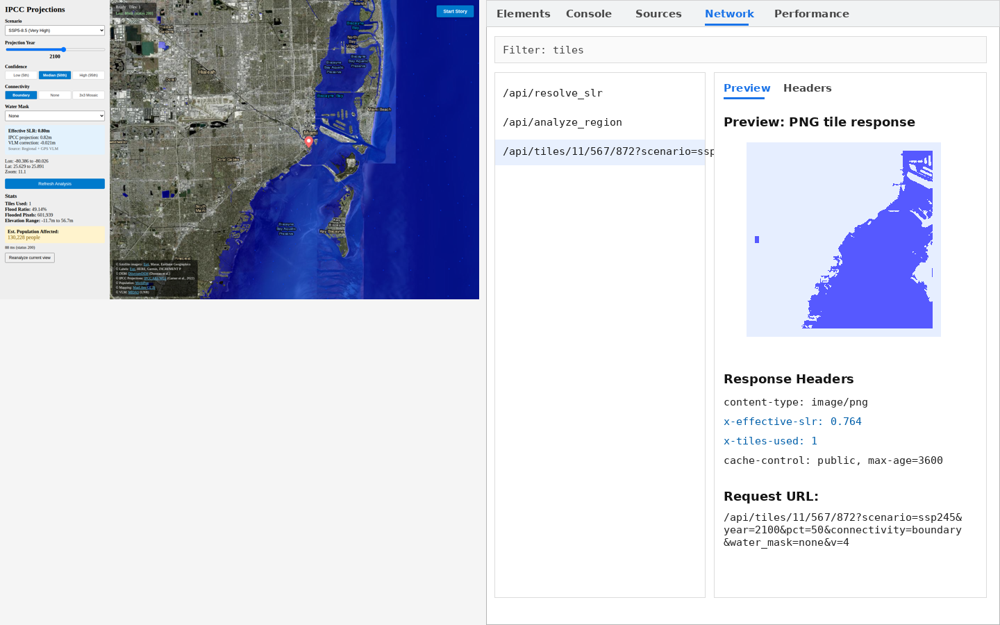

# API Reference

All endpoints are exposed through the gateway at `/api/*`.
In local development (Vite on port 5173 + uvicorn on port 8000) the frontend rewrites the
base URL to `http://localhost:8000` automatically.

Base URL (production): `https://<your-domain>/api`

---

## GET `/api/health`

Health check. Returns the number of DEM tiles currently indexed.

**Response**

```json
{
  "status": "ok",
  "tiles_indexed": 842
}
```

| Field | Type | Description |
|-------|------|-------------|
| `status` | string | Always `"ok"` when the service is running |
| `tiles_indexed` | integer | Number of DEM GeoTIFFs in the spatial index |

If `tiles_indexed` is 0, no elevation data is loaded and the flood overlay will not render.

---

## GET `/api/stats`

Returns active user count and tile index size. Intended for monitoring dashboards.

**Response**

```json
{
  "active_users_5m": 4,
  "tiles_indexed": 842
}
```

| Field | Type | Description |
|-------|------|-------------|
| `active_users_5m` | integer | Unique IPs active in the last 5 minutes |
| `tiles_indexed` | integer | Number of DEM tiles indexed |

---

## GET `/api/tiles/{z}/{x}/{y}`

Render a 256×256 PNG flood overlay tile in the standard Web Mercator tile coordinate system.

**Path parameters**

| Parameter | Type | Description |
|-----------|------|-------------|
| `z` | integer | Zoom level (0–22) |
| `x` | integer | Tile column |
| `y` | integer | Tile row |

**Query parameters**

| Parameter | Type | Default | Description |
|-----------|------|---------|-------------|
| `scenario` | string | — | SSP scenario: `ssp126`, `ssp245`, `ssp370`, `ssp585` |
| `year` | integer | — | Projection year (2020–2200) |
| `pct` | integer | `50` | Percentile: `5`, `50`, or `95` |
| `slr` | float | — | Direct SLR in meters (legacy mode; overrides scenario/year/pct) |
| `connectivity` | string | `boundary` | Flood connectivity: `boundary`, `none`, `full` |
| `water_mask` | string | `none` | Water mask: `none`, `raster` |

**Response**

- **200** — `image/png` (256×256 RGBA; transparent where not flooded, blue `[0,0,255,160]` where flooded)
- **400** — Invalid tile coordinates or parameter values
- **500** — Tile rendering error

**Response headers**

| Header | Value | Description |
|--------|-------|-------------|
| `X-Effective-SLR` | e.g. `0.563` | Effective SLR in meters used for this tile |
| `X-Tiles-Used` | e.g. `2` | Number of DEM tiles that intersected the tile bbox |
| `X-Cache` | `HIT` | Present only when the response came from Redis |
| `Cache-Control` | `public, max-age=3600` | Browser caching TTL |

**Example**

```
GET /api/tiles/10/300/400?scenario=ssp245&year=2100&pct=50&connectivity=boundary
```



---

## GET `/api/analyze_region`

Analyze a geographic bounding box for flood risk. Returns elevation statistics, flood pixel
counts, and estimated population affected.

> **Important:** If the bbox spans more than 40° in latitude or longitude the frontend skips
> this request. Zoom in to trigger analysis.

**Query parameters**

| Parameter | Type | Required | Description |
|-----------|------|----------|-------------|
| `lon_min` | float | Yes | West bound (−180 to 180) |
| `lat_min` | float | Yes | South bound (−90 to 90) |
| `lon_max` | float | Yes | East bound (−180 to 180) |
| `lat_max` | float | Yes | North bound (−90 to 90) |
| `scenario` | string | Yes* | SSP scenario |
| `year` | integer | Yes* | Projection year |
| `pct` | integer | No | Percentile (default 50) |
| `slr` | float | No | Direct SLR override (legacy) |
| `sample_limit` | integer | No | Max flooded pixel samples returned (default 100, max 10 000) |

\* `scenario` and `year` are required unless `slr` is provided.

**Response (200)**

```json
{
  "bbox": {
    "lon_min": -80.5,
    "lat_min": 25.5,
    "lon_max": -80.0,
    "lat_max": 26.0
  },
  "slr": 0.563,
  "scenario": "ssp245",
  "year": 2100,
  "percentile": 50,
  "tiles_used": ["DiluviumDEM_N25_00_W081_00"],
  "crs": "EPSG:4326",
  "elevation_min": -2.1,
  "elevation_max": 14.7,
  "elevation_mean": 3.4,
  "flooded_count": 12480,
  "total_valid": 51200,
  "flood_ratio": 0.2437,
  "flooded_pixels": [
    {"x": -80.45, "y": 25.62},
    {"x": -80.43, "y": 25.61}
  ],
  "estimated_population_affected": 83400
}
```

| Field | Type | Description |
|-------|------|-------------|
| `slr` | float | Effective SLR used (meters) |
| `tiles_used` | array | DEM tile names that intersected the bbox |
| `elevation_min/max/mean` | float | Elevation statistics across valid DEM pixels |
| `flooded_count` | integer | Number of DEM pixels below SLR threshold (boundary-connected) |
| `total_valid` | integer | Total valid (non-nodata) DEM pixels in bbox |
| `flood_ratio` | float | `flooded_count / total_valid` |
| `flooded_pixels` | array | Sampled lon/lat centroids of flooded pixels (for map overlay) |
| `estimated_population_affected` | integer | Sum of WorldPop 2020 population in flooded pixels |

**Error responses**

| Code | Reason |
|------|--------|
| 404 | No DEM data for the requested bbox |
| 500 | Analysis error (check backend logs) |

---

## GET `/api/resolve_slr`

Resolve the effective sea level rise for a specific location and scenario. Used by the
frontend to populate the "Effective SLR" box in the sidebar.

**Query parameters**

| Parameter | Type | Required | Description |
|-----------|------|----------|-------------|
| `lat` | float | Yes | Latitude |
| `lon` | float | Yes | Longitude |
| `scenario` | string | Yes | SSP scenario |
| `year` | integer | Yes | Projection year |
| `pct` | integer | No | Percentile (default 50) |

**Response (200)**

```json
{
  "slr_meters": 0.563,
  "ipcc_slr_meters": 0.520,
  "vlm_offset_meters": 0.043,
  "vlm_rate_mm_yr": 2.15,
  "vlm_source": "gps_midas",
  "projection_source": "regional",
  "scenario": "ssp245",
  "year": 2100,
  "percentile": 50,
  "lat": 25.76,
  "lon": -80.19
}
```

| Field | Type | Description |
|-------|------|-------------|
| `slr_meters` | float | Combined SLR (IPCC + VLM) |
| `ipcc_slr_meters` | float | IPCC AR6 projection only |
| `vlm_offset_meters` | float | VLM correction (positive = subsidence = more flooding) |
| `vlm_rate_mm_yr` | float | VLM rate in mm/year at this location |
| `vlm_source` | string | `"gps_midas"`, `"gia_ice6g"`, or `"none"` |
| `projection_source` | string | `"regional"` or `"global_mean"` |

**Error responses**

| Code | Reason |
|------|--------|
| 400 | Invalid scenario or percentile |

---

## GET `/api/tiles/info`

Return coverage metadata for the loaded DEM tile set.

**Response (200)**

```json
{
  "total_tiles": 842,
  "coverage": {
    "lat_min": 14.0,
    "lat_max": 60.0,
    "lon_min": -125.0,
    "lon_max": 145.0
  }
}
```

Useful for verifying which geographic regions have elevation data available.

---

## GET `/api/projection_info`

Return available scenario metadata. Optionally include the full projection curve and VLM
info for a specific location.

**Query parameters (optional)**

| Parameter | Type | Description |
|-----------|------|-------------|
| `lat` | float | Latitude for location-specific projection |
| `lon` | float | Longitude for location-specific projection |

**Response (200)**

```json
{
  "scenarios": ["ssp126", "ssp245", "ssp370", "ssp585"],
  "percentiles": [5, 50, 95],
  "years": [2030, 2040, 2050, 2060, 2070, 2080, 2090, 2100, 2110, 2120, 2130, 2140, 2150],
  "projection_loaded": true,
  "projection_at": { ... },
  "vlm": { ... }
}
```

---

## GET `/api/debug/tiles_in_bbox`

List DEM tiles intersecting a bounding box. Only available when `DEBUG_MODE=true` is set.

**Query parameters:** `lon_min`, `lat_min`, `lon_max`, `lat_max`

**Response (200)**

```json
{
  "request_bbox": [-81.0, 25.0, -80.0, 26.0],
  "count": 2,
  "tiles": ["DiluviumDEM_N25_00_W081_00", "DiluviumDEM_N25_00_W080_00"]
}
```

---

## Deprecated Endpoints

| Endpoint | Status | Notes |
|----------|--------|-------|
| `GET /api/analyze?city=...&slr=...` | Deprecated | City-based analysis; use `analyze_region` instead |
| `GET /api/cities` | Deprecated | Returns empty list; city model removed |
