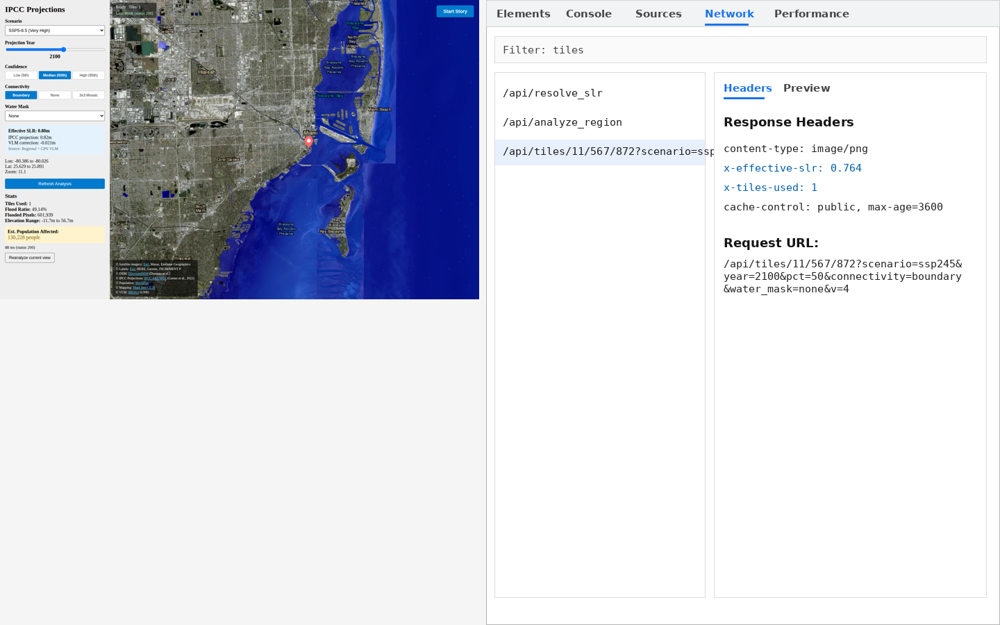

# Architecture

This page describes the system design, service layout, and the data flow for a tile request
and a region analysis request.

---

## Services

```
Browser
  │
  │ HTTP (dev/ip mode) or HTTPS (public mode)
  ▼
┌─────────────────────────────────────────────┐
│  Caddy edge (public HTTPS mode only)        │
│  TLS + public 80/443                        │
└─────────────────────────────────────────────┘
  │
  ▼
┌─────────────────────────────────────────────┐
│  Gateway (Nginx)                            │
│  /api/*  → backend:8000                     │
│  /*      → frontend:8080                    │
└─────────────────────────────────────────────┘
       │                    │
       ▼                    ▼
  ┌─────────┐         ┌──────────┐
  │ Backend │         │ Frontend │
  │ FastAPI │         │  React   │
  │  :8000  │         │  Nginx   │
  └────┬────┘         │  :8080   │
       │              └──────────┘
  ┌────┴────────────────────────┐
  │  Local filesystem           │
  │  Backend/dem/       DEM GeoTIFFs (read-only)
  │  Backend/wp_2020/   WorldPop GeoTIFFs (read-only)
  │  Backend/data/      IPCC + VLM JSON (read-only)
  │  Backend/tile_cache/.sessions  (session tracking)
  └─────────────────────────────┘
       │
  ┌────┴────┐  (optional)
  │  Redis  │  L2 tile cache (2 GB LRU)
  │  :6379  │
  └─────────┘
```

Base stack services (`backend`, `redis`, `frontend`, `gateway`) run on an isolated `slr-net`
bridge network. In `public-up` mode, `caddy` is added in front of `gateway`, and `gateway`
is bound to localhost while Caddy exposes public ports 80/443.

---

## Frontend

**Stack:** React 18, Vite (build tool), MapLibre GL JS

| File | Role |
|------|------|
| `Frontend/src/main.jsx` | React entry point |
| `Frontend/src/App.jsx` | Root component — owns all state (scenario, year, pct, bbox, floodData, etc.) |
| `Frontend/src/MapView.jsx` | MapLibre GL JS wrapper — renders basemap, flood raster tiles, city markers |
| `Frontend/src/StoryMap.jsx` | Story mode panel — prev/next navigation, story text |
| `Frontend/src/LandingPage.jsx` | Disclaimer gate — blocks access until accepted |
| `Frontend/src/api.js` | `analyzeRegion()` and `fetchResolvedSlr()` — typed fetch wrappers |
| `Frontend/src/utils.js` | `escapeHtml()` and other small helpers |

### State flow in App.jsx

```
User changes scenario / year / pct
  → setScenario / setYear / setPercentile
  → useEffect: fetch /api/resolve_slr → setResolvedSlr
  → useEffect (debounced 250 ms): fetch /api/analyze_region → setFloodData

Map pans / zooms
  → MapView emits onBoundsChange(bounds)
  → App: setBbox(bounds)
  → same useEffects fire again
```

`MapView` subscribes to `scenario`, `year`, `percentile`, `connectivityMode`,
`waterMaskMode`, and `resolvedSlr` as props. When any of those change it calls
`source.setTiles([newTileUrl])` on the MapLibre raster source so the tile layer
reloads automatically.

---

## Backend

**Stack:** Python 3.11, FastAPI, Rasterio, NumPy, SciPy, Mercantile, Pillow

### Startup sequence (`lifespan` context manager)

1. `build_tile_index()` — scans `Backend/dem/` (or a DigitalOcean Spaces bucket) and
   builds two in-memory structures:

   - `TILE_INDEX` — `{tile_name: {bounds, path}}`
   - `TILE_GRID` — `{(lat_cell, lon_cell): [tile_names]}` — O(1) spatial lookup by 1°×1° cell

2. `load_population_data()` — opens all WorldPop GeoTIFFs in `Backend/wp_2020/` and keeps
   their `rasterio.DatasetReader` handles open for fast windowed reads.

3. `water_mask.load_provider()` — loads the optional water mask raster.

4. `projection.load_projections(path)` — reads IPCC AR6 JSON; falls back to embedded global-
   mean table if the file is absent.

5. `vlm.load_vlm(gia_path, gps_path)` — reads ICE-6G_C + MIDAS JSON; falls back to 0 mm/yr.

---

## Tile Request Data Flow

```
GET /api/tiles/{z}/{x}/{y}?scenario=ssp245&year=2100&pct=50
                            &connectivity=boundary&water_mask=none

1. Validate z/x/y range
2. Resolve effective SLR
   a. mercantile.bounds(x,y,z) → tile center lat/lon
   b. projection.resolve_slr(lat, lon, scenario, year, pct)
      → nearest-neighbor lookup into IPCC AR6 KD-tree, or global-mean fallback
   c. vlm.resolve_vlm_offset(lat, lon, year)
      → GPS station lookup (MIDAS), else GIA grid, else 0
   d. slr_meters = base_slr + vlm_offset

3. find_tiles_in_bbox(west, south, east, north)
   → walk TILE_GRID cells the tile bbox overlaps → O(k) candidate tiles

4. Check Redis L2 cache (key: tile:z:x:y:slr:connectivity:water_mask)

5. render_tile_png_multi_cached(tile_paths, slr_meters, z, x, y, ...)
   (LRU-cached on the same key fields)
   
   5a. mercantile.xy_bounds → Web Mercator target bounds
   5b. For each DEM path: windowed rasterio read of the intersecting region
       (single tile: direct window; multiple tiles: rasterio.merge over bbox)
   5c. reproject() → EPSG:3857 256×256 grid (bilinear)
   5d. flood mask: dst_arr < slr_meters
   5e. (optional) apply water mask
   5f. _keep_boundary_connected_flood(): binary_propagation from tile edges
       (skipped if connectivity=none; full mode renders 3×3 then crops)
   5g. RGBA array: flooded pixels → [0, 0, 255, 160]
   5h. Pillow → PNG bytes

6. Store in Redis L2 cache (TTL 3600 s)
7. Return PNG with Cache-Control: public, max-age=3600
```



---

## Region Analysis Data Flow

```
GET /api/analyze_region?lon_min=...&lat_min=...&lon_max=...&lat_max=...
                        &scenario=ssp245&year=2100&pct=50

1. Resolve effective SLR (same logic as tile endpoint, using region center)
2. find_tiles_in_bbox → list of overlapping DEM tiles
3. For each tile:
   a. Windowed rasterio read (intersection of tile and request bbox)
   b. Elevation stats (min, max, mean, valid count)
   c. Flood mask: arr < slr_meters; apply _keep_boundary_connected_flood()
   d. Population cross-reference:
      - Pre-filter WorldPop rasters to those intersecting the bbox
      - For each WorldPop pixel center in the window: map to DEM row/col
      - Sum population values where DEM says flooded
   e. Sample up to `sample_limit` flooded pixel centroids for the map overlay
4. Aggregate across tiles → return JSON
```

---

## Caching Strategy

| Level | Mechanism | Scope | TTL |
|-------|-----------|-------|-----|
| L1 in-memory | `functools.lru_cache` (Python per-worker) | Tile PNG bytes | Until LRU eviction |
| L2 shared | Redis (optional) | Tile PNG bytes | 3600 s |
| Browser | `Cache-Control: public, max-age=3600` | Tile responses | 1 hour |

The `TILE_CACHE_SIZE` environment variable sets the LRU maxsize (default 512 entries, Docker
Compose default 2048).

> **Note:** Browser caching is intentionally set to 1 hour via the `max-age` header. The
> tile URL includes the full scenario+year+pct+connectivity+water_mask parameters, so changing
> any control generates new URLs and bypasses stale cached tiles.

---

## Spatial Index Design

A two-level index avoids an O(n) scan over thousands of DEM tiles per request:

1. **`TILE_GRID`** — dictionary keyed by `(lat_cell, lon_cell)` integer degree pairs.
   Each entry lists the tile names whose bounding box covers that degree cell.
2. **`TILE_INDEX`** — dictionary keyed by tile name storing bounds and filesystem path.

Lookup for a Web Mercator tile at zoom 10 typically hits 1–4 grid cells, returning at most
a handful of candidate DEM tiles regardless of how many total tiles are loaded.

---

## VLM Resolution

```
vlm.resolve_vlm_offset(lat, lon, year)

1. GPS stations (MIDAS): find nearest within 0.5° radius
   → interpolate mm/yr rate × (year − 2005) → meters
2. GIA grid (ICE-6G_C): nearest-neighbor lookup
   → interpolate mm/yr rate × (year − 2005) → meters
3. Fallback: 0 meters
```

Positive offset = land sinking relative to sea = more flooding than the IPCC base projection.
Negative offset = land rising = less flooding (e.g. post-glacial rebound in Scandinavia).

---

## Connectivity Mode Implementation

```python
def _keep_boundary_connected_flood(mask: np.ndarray) -> np.ndarray:
    boundary = np.zeros_like(mask, dtype=bool)
    boundary[0, :] = mask[0, :]
    boundary[-1, :] = mask[-1, :]
    boundary[:, 0] |= mask[:, 0]
    boundary[:, -1] |= mask[:, -1]
    return binary_propagation(boundary, structure=np.ones((3,3)), mask=mask)
```

`binary_propagation` from `scipy.ndimage` flood-fills from the tile boundary pixels through
all connected flooded pixels. Any isolated inland basin not touching the tile edge is removed.

In **full** (3×3 mosaic) mode the tile is rendered at 3× size over a 3×3 tile neighborhood
first, so flooding can propagate across tile boundaries, and then the center 256×256 crop is
returned.
