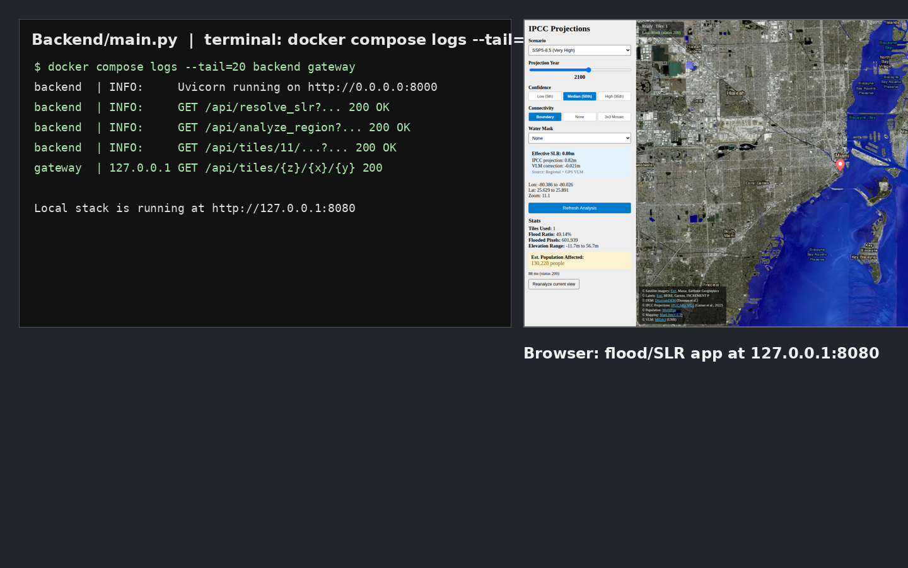

# Development

This page covers setting up a local development environment without Docker, running tests,
and the overall code structure.

---

## Prerequisites

| Tool | Version |
|------|---------|
| Python | 3.11+ |
| Node.js | 18+ |
| npm | 9+ |
| Git | Any recent |

Optional but recommended:
- VS Code with the Python and ESLint extensions
- GDAL tools (`gdal-info`, `gdalwarp`) for DEM inspection

---

## Backend Setup

### 1. Create a virtual environment

```bash
cd Backend
python3.11 -m venv .venv
source .venv/bin/activate        # Windows: .venv\Scripts\activate
pip install -r Requirements.txt
```

### 2. Place DEM data

```bash
mkdir -p dem
# copy DiluviumDEM_*.tif files into Backend/dem/
```

### 3. Start the development server

```bash
# From project root (resolves module imports correctly):
python -m uvicorn Backend.main:app --reload --host 0.0.0.0 --port 8000 --app-dir .

# Or from the Backend/ directory:
cd Backend
uvicorn main:app --reload --host 0.0.0.0 --port 8000
```

Alternatively, use the VS Code task **Run Uvicorn (Backend, app-dir)** if you have the
workspace open.

The API is available at `http://localhost:8000`. Swagger UI at `http://localhost:8000/docs`.

---

## Frontend Setup

```bash
cd Frontend
npm install
npm run dev
```

Vite starts on `http://localhost:5173`. In dev mode the frontend auto-detects that it is on
port 5173 and rewrites API requests to port 8000 (uvicorn) instead of the gateway.

```js
// Frontend/src/MapView.jsx — tile URL logic
const origin = window.location.origin;
const apiBase = origin.includes(':5173') ? origin.replace(':5173', ':8000') : '/api';
```

So you do **not** need Nginx or the gateway running in local dev.



---

## Running Tests

### Backend (pytest)

```bash
cd Backend
source .venv/bin/activate
pytest -v
```

Test files are in `Backend/tests/`. Key test modules:

| File | What it tests |
|------|--------------|
| `test_api.py` | FastAPI endpoint responses and error handling |
| `test_spatial_index.py` | `parse_dem_filename`, `build_tile_index`, `find_tiles_in_bbox` |
| `test_water_mask.py` | Water mask provider loading and masking |

The `pytest.ini` in `Backend/` configures the test paths and settings.

### Frontend (Vitest)

```bash
cd Frontend
npm test          # run once
npm run test:watch  # watch mode
```

Test files are in `Frontend/src/__tests__/`. Key test files:

| File | What it tests |
|------|--------------|
| `App.test.jsx` | Root component rendering and state transitions |
| `MapView.test.jsx` | Map initialization and prop handling |
| `api.test.js` | `analyzeRegion` and `fetchResolvedSlr` fetch wrappers |
| `StoryMap.test.jsx` | Story panel navigation |

MapLibre GL JS is mocked in `__tests__/__mocks__/maplibre-gl.js` to avoid WebGL initialization
in the test environment.

---

## Code Structure

### Backend

```
Backend/
├── main.py           # FastAPI app — all endpoints, tile rendering, spatial index
├── projection.py     # IPCC AR6 projection loader and resolver
├── vlm.py            # VLM loader (ICE-6G_C + MIDAS) and resolver
├── water_mask.py     # Optional water mask raster provider
├── download_ipcc_ar6.py  # Data downloader
├── download_vlm.py       # Data downloader
├── download_worldpop.py  # Data downloader
├── Requirements.txt
├── pytest.ini
└── tests/
    ├── test_api.py
    ├── test_spatial_index.py
    └── test_water_mask.py
```

**Key functions in `main.py`:**

| Function | Role |
|----------|------|
| `build_tile_index()` | Scan DEM directory, build `TILE_INDEX` and `TILE_GRID` |
| `find_tiles_in_bbox()` | O(k) spatial lookup using `TILE_GRID` |
| `render_tile_png_multi()` | Core tile rendering: windowed read → reproject → flood mask → PNG |
| `_keep_boundary_connected_flood()` | `scipy.ndimage.binary_propagation` from tile edges |
| `get_tile()` | `/tiles/{z}/{x}/{y}` endpoint handler |
| `analyze_region()` | `/analyze_region` endpoint handler |

### Frontend

```
Frontend/src/
├── main.jsx          # React entry point
├── App.jsx           # Root state: scenario, year, pct, bbox, floodData
├── MapView.jsx       # MapLibre GL JS: basemap, flood raster, city markers
├── StoryMap.jsx      # Story mode panel
├── LandingPage.jsx   # Disclaimer page
├── api.js            # analyzeRegion(), fetchResolvedSlr() fetch wrappers
└── utils.js          # escapeHtml()
```

---

## Linting and Formatting

The project does not currently enforce a specific formatter. Recommended:

- **Python:** `ruff` or `black` (not configured)
- **JavaScript/JSX:** ESLint (VS Code `eslint` extension reads the project's config)

---

## Environment Variables in Development

You can create a `Backend/.env` file (not tracked by git) and load it manually, or just set
variables in your shell:

```bash
export TILE_CACHE_SIZE=256
export DEBUG_MODE=true
```

See [Configuration](Configuration) for the full list.

---

## Adding a New API Endpoint

1. Add the route in `Backend/main.py` using FastAPI decorators.
2. Add a fetch wrapper in `Frontend/src/api.js` if the frontend needs to call it.
3. Write a test in `Backend/tests/test_api.py`.
4. Document the endpoint in the [API Reference](API-Reference) wiki page.

---

## Common Development Pitfalls

| Problem | Fix |
|---------|-----|
| `ModuleNotFoundError: No module named 'projection'` | Run uvicorn from the `Backend/` directory or use `--app-dir Backend` |
| Frontend shows blank page | Check browser console; usually a CORS error if the API base URL is wrong |
| Tiles load but show no flood | Check `tiles_indexed` and DEM filename format |
| Tests fail with `ImportError` | Activate the virtualenv before running pytest |
| `rasterio` import error | GDAL native libs may be missing; reinstall with `pip install rasterio` or use the Docker image |
