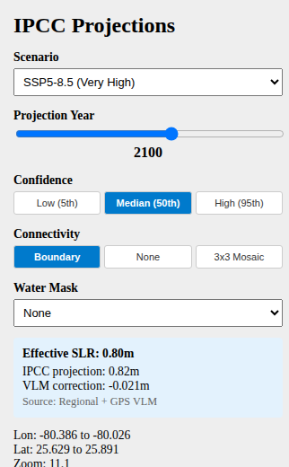

# Flood & Sea Level Rise Visualization — Wiki Home

**An interactive map of how high the sea may rise — and who lives in the way.**

🌐 **Live demo:** <https://oursealevel.org> · <https://sea-level-rise.org>
💻 **Source:** [github.com/ajprice16/flood-slr-visualization](https://github.com/ajprice16/flood-slr-visualization)


---

## What it does

Choose an IPCC sea level rise scenario, a year between 2030 and 2150, and a confidence
percentile. The map shows — in real time — which coastlines fall below the resulting water
level, and estimates how many people live in the inundated area today.

It is built so that every step from raw science to the blue overlay on the screen is
inspectable:

- The **sea level projections** come from the IPCC AR6 WG1 Regional Sea-Level dataset
  (Garner et al., 2022). The map looks up the *nearest IPCC station* to the tile center,
  not a single global average.
- **Vertical land motion** (subsidence and post-glacial rebound) is applied per location using
  MIDAS GPS velocities and the ICE-6G_C glacial isostatic adjustment model.
- **Elevations** come from DiluviumDEM, a coastal-optimized DEM that corrects known overestimates
  of SRTM in low-lying coastal areas.
- **Population exposure** is computed from WorldPop 2020 ~1 km gridded population.

Each tile is rendered on demand from the source elevation data — nothing is pre-baked.

---

## Pick your starting page

### I want to explore

| If you want to… | Go to |
|-----------------|-------|
| Try the live tool right now | <https://oursealevel.org> |
| Understand every control in the map | [User Guide](User-Guide) |
| Take a guided city tour | [Story Mode](Story-Mode) |
| Read the science and citations | [Data Sources](Data-Sources) |

### I want to run or extend it

| If you want to… | Go to |
|-----------------|-------|
| Run it locally with Docker | [Getting Started](Getting-Started) |
| Set up a development environment | [Development](Development) |
| Deploy it publicly with HTTPS | [Deployment](Deployment) |
| Understand the system design | [Architecture](Architecture) |
| Use the REST API | [API Reference](API-Reference) |
| Tune environment variables | [Configuration](Configuration) |
| Pre-launch hardening | [Launch Checklist](Launch-Checklist) |
| Fix something that's broken | [Troubleshooting](Troubleshooting) |

---

## Feature tour

### Scenario-based sea level rise

Four IPCC AR6 Shared Socioeconomic Pathway (SSP) scenarios, projection years from 2030 to
2150 in 10-year steps, and three confidence percentiles (5th, 50th, 95th). The backend
resolves the effective sea level for the tile center using the regional IPCC AR6 dataset
when present, falling back to an embedded global-mean table from IPCC AR6 Table 9.9.



### Vertical land motion correction

Many coastal cities are *moving* relative to mean sea level. Tokyo Bay, the Bengal delta, and
Jakarta are sinking; northern Scandinavia is rising. The tool corrects for this per location:

- **MIDAS / NGL GPS velocities** — observed total VLM at GNSS stations worldwide
- **ICE-6G_C GIA model** — used where there is no nearby GPS station

A GPS station within 0.5° of the query point takes precedence over the GIA model. The
correction is applied as a meters-per-year rate multiplied by `(year − 2005)`.

### Population impact estimates

When the viewport is small enough (< 40° in either dimension), the backend cross-references
flooded DEM pixels with WorldPop 2020 ~1 km population rasters and reports the estimated
population in the inundated area.

### Story Mode

Five curated city narratives — Miami, New Orleans, Tokyo, Tabasco (Mexico), and Bangladesh —
each pre-loaded with a recommended scenario and zoom level. The sidebar collapses and a
story panel slides in from the left.


### Connectivity modes

Pure bathtub inundation overstates flooding by coloring isolated inland depressions blue. The
tool offers three connectivity treatments:

| Mode | Behaviour |
|------|-----------|
| **Boundary** (default) | Only color flood pixels connected to the tile edge. Removes isolated inland basins. |
| **None** | Color every pixel below the threshold, regardless of ocean connectivity. |
| **3×3 Mosaic** | Render a 3-tile-wide neighborhood so flooding propagates across tile seams, then crop to the center. |

The default — Boundary — gives the closest approximation to realistic coastal inundation
without requiring a full hydrodynamic model.

---

## What it is not

This is **not** a hydrodynamic flood model. It does not represent:

- Storm surge, waves, tides, or king tides
- Levees, sea walls, pumps, or other coastal defenses
- Drainage, runoff, or river flooding
- Soil saturation or groundwater response
- Time-varying ice-sheet dynamics beyond what the IPCC percentiles capture

The flood overlay is a **static, threshold-based inundation surface** with connectivity
filtering. Use it for *exposure and screening analysis*, not for engineering decisions. See
the [Data Sources](Data-Sources) page for the full methodology and caveats.

---

## Technology stack

| Layer | Technology |
|-------|-----------|
| Frontend | React 18, Vite, MapLibre GL JS |
| Backend | Python 3.11, FastAPI, Rasterio, NumPy, SciPy, Mercantile, Pillow |
| Caching | In-memory LRU + optional Redis L2 |
| Reverse Proxy | Nginx (dev/IP), Caddy (public HTTPS) |
| Orchestration | Docker Compose |
| Elevation Data | DiluviumDEM GeoTIFFs |
| Population Data | WorldPop 2020 GeoTIFFs |
| Projections | IPCC AR6 WG1 Regional SLR (Garner et al., 2022) |

---

## Repository layout

```
Backend/   FastAPI service — tile rendering, analysis, projection & VLM lookups
Frontend/  React SPA — map UI, sidebar controls, story mode, landing page
Gateway/   Nginx reverse proxy configuration
deploy/    Production scripts, Caddyfile, environment templates
wiki/      The pages you are reading
```

---

## License and attribution

The dataset and basemap providers retain their own licenses — see [Data Sources](Data-Sources)
for a full attribution table. The source code in this repository is currently unlicensed;
treat it as proprietary unless a license file is added.
