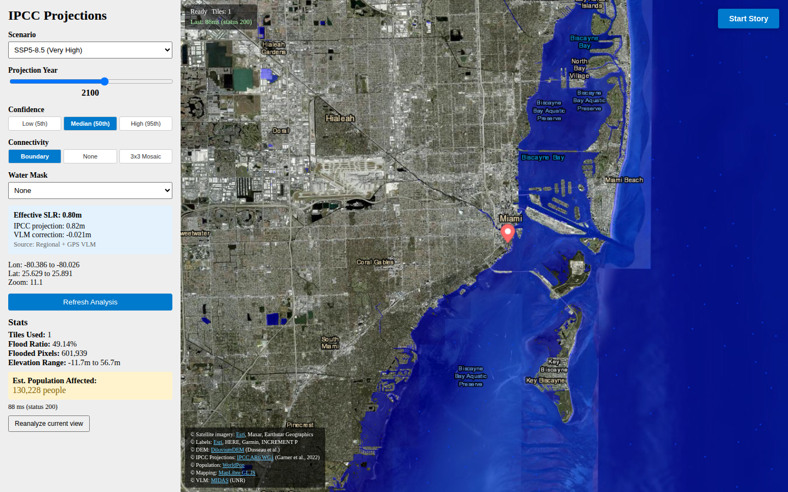
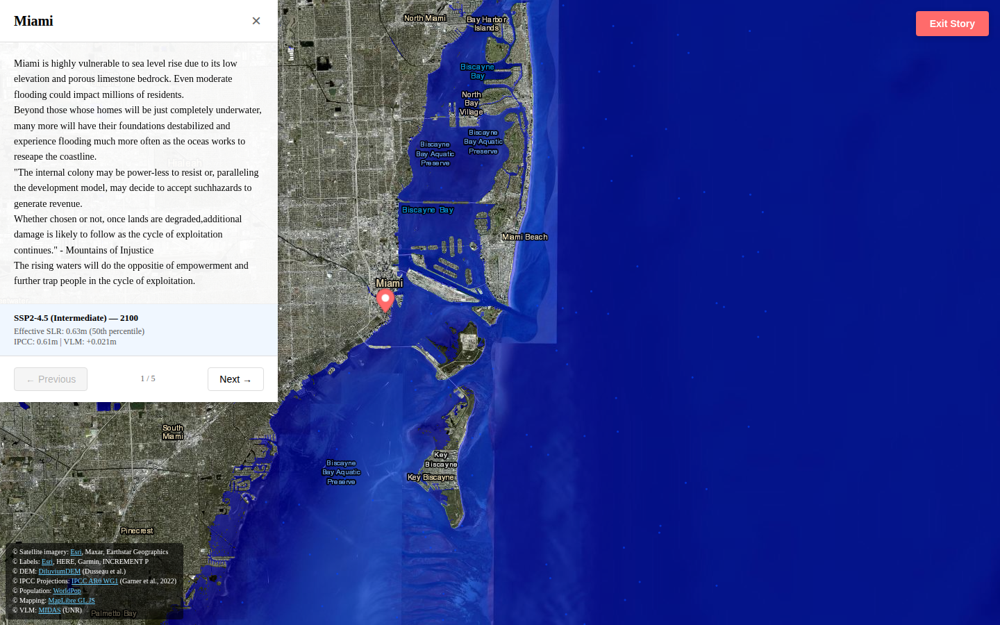
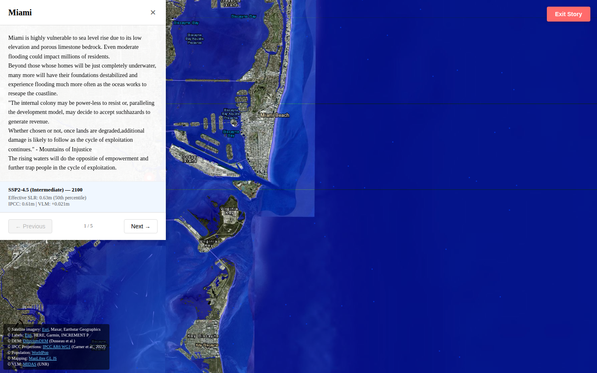
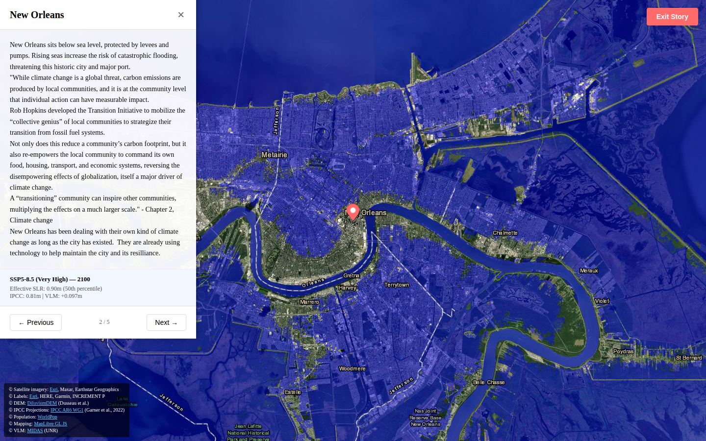
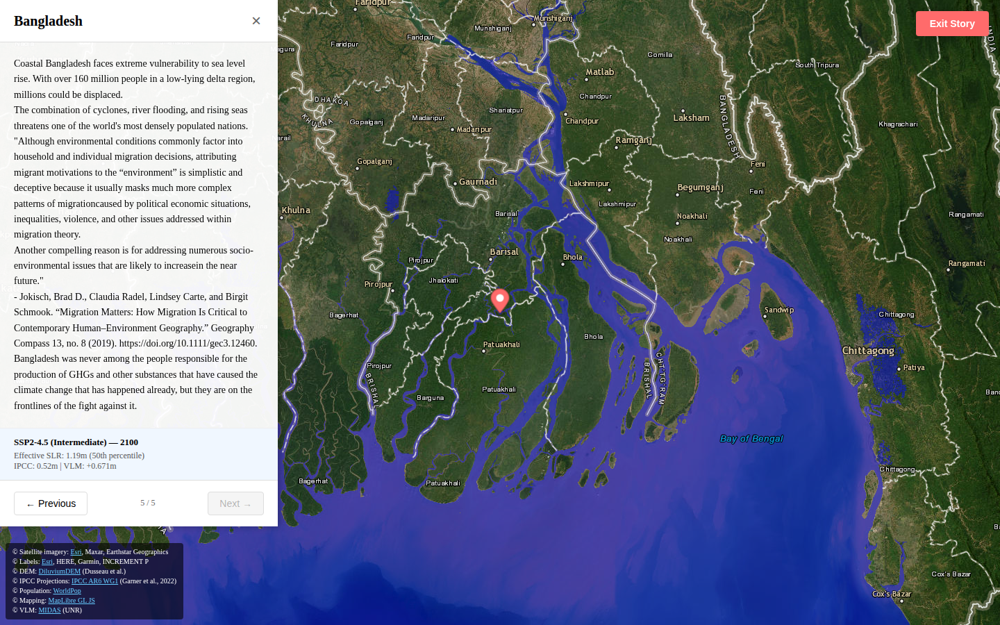

# Story Mode

Story Mode is a guided, full-screen tour that visits five coastal locations, each pre-configured
with a recommended scenario and year, and accompanied by a short narrative about local flood risk.

---

## Entering Story Mode

Click **Start Story** in the top-right corner of the interactive map.



The sidebar disappears and the story panel slides in from the left. The map flies to the first
city (Miami) using a 2-second animated transition.



---

## Story Panel Controls

| Element | Action |
|---------|--------|
| City name (header) | Identifies the current location |
| Narrative text | Short description of local flood vulnerability |
| Scenario / year / percentile badge | Shows the parameters pre-set for this story |
| **← Previous** button | Go to the prior city |
| **→ Next** button | Advance to the next city |
| **✕ Close / Exit Story** button | Return to the interactive map |

Progress through all five cities in order, or click **Exit Story** at any time to return to
the interactive map. Your sidebar settings (scenario, year, percentile) are restored when you
exit.

---

## City Stories

### 1. Miami, Florida

| Parameter | Value |
|-----------|-------|
| Coordinates | 25.7617° N, 80.1918° W |
| Zoom | 11 |
| Scenario | SSP2-4.5 (Intermediate) |
| Year | 2100 |
| Percentile | 50th |

Miami faces some of the highest relative sea level rise rates in the United States due to a
combination of global SLR and local land subsidence. Much of the city sits at or below 2 m
elevation. Under SSP2-4.5 at 2100, significant portions of Miami Beach and the low-lying
urban core are projected to be below the effective sea level.



---

### 2. New Orleans, Louisiana

| Parameter | Value |
|-----------|-------|
| Coordinates | 29.9511° N, 90.0715° W |
| Zoom | 11 |
| Scenario | SSP5-8.5 (Very High) |
| Year | 2100 |
| Percentile | 50th |

New Orleans is one of the most vulnerable cities in the world, with large portions already
below sea level and relying on levee systems. The story uses SSP5-8.5 to illustrate a high-
emissions trajectory where subsidence and SLR combine to put the greater New Orleans basin
well below projected sea level.



---

### 3. Tokyo, Japan

| Parameter | Value |
|-----------|-------|
| Coordinates | 35.6895° N, 139.6917° E |
| Zoom | 11 |
| Scenario | SSP2-4.5 (Intermediate) |
| Year | 2100 |
| Percentile | 50th |

Tokyo Bay's low-lying industrial and residential areas are at risk. Japan has experienced
significant historical subsidence from groundwater extraction, and Tokyo has some of the
highest GDP-per-area density of any coastal city.

---

### 4. Tabasco, Mexico

| Parameter | Value |
|-----------|-------|
| Coordinates | 17.99° N, 92.93° W |
| Zoom | 8 |
| Scenario | SSP3-7.0 (High) |
| Year | 2100 |
| Percentile | 50th |

The state of Tabasco in southern Mexico includes large areas of the Grijalva-Usumacinta delta
system at near-zero elevation. Under a high-emissions scenario, extensive agricultural and
wetland areas are projected to be inundated.

---

### 5. Bangladesh

| Parameter | Value |
|-----------|-------|
| Coordinates | 22.5° N, 90.4° E |
| Zoom | 8 |
| Scenario | SSP2-4.5 (Intermediate) |
| Year | 2100 |
| Percentile | 50th |

The Ganges-Brahmaputra-Meghna delta is one of the world's largest river deltas and home to
millions of people at or near sea level. Bangladesh is widely cited as one of the countries
most vulnerable to sea level rise.



---

## Adding New Story Locations

Story locations are defined in two places:

### 1. `Frontend/src/App.jsx` — the `stories` array

```jsx
const stories = [
    {
        name: "City Name",
        coords: [longitude, latitude],
        zoom: 11,
        scenario: "ssp245",
        year: 2100,
        percentile: 50,
        textFile: "/cities/city-name.txt",
        media: null
    },
    // ...
];
```

### 2. `Frontend/public/cities/city-name.txt` — the narrative text

Create a plain-text file with a short (2–4 sentence) description. The text is displayed
directly in the story panel and the city marker popup on the map.

City markers on the map (the red pins) are defined separately in `Frontend/src/MapView.jsx`
in the `addCityMarkers` async function. Add a matching entry there to show the pin for a new
city.

---

## Map Interaction During Story Mode

The map remains fully interactive during story mode — you can pan, zoom, and observe the
flood overlay at full resolution. However, the sidebar controls are hidden; to change the
scenario or year, exit story mode first.
