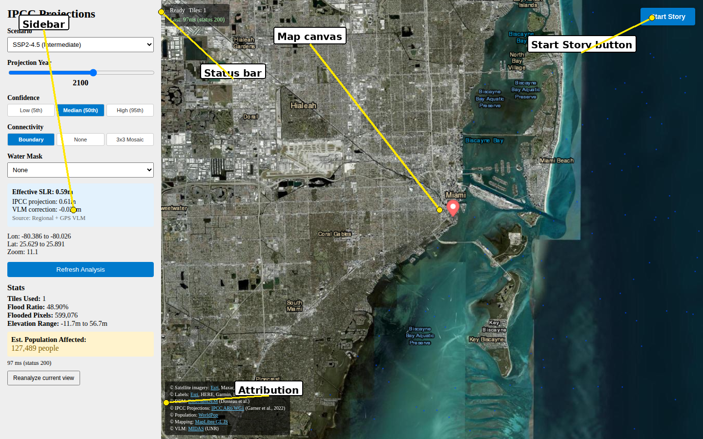
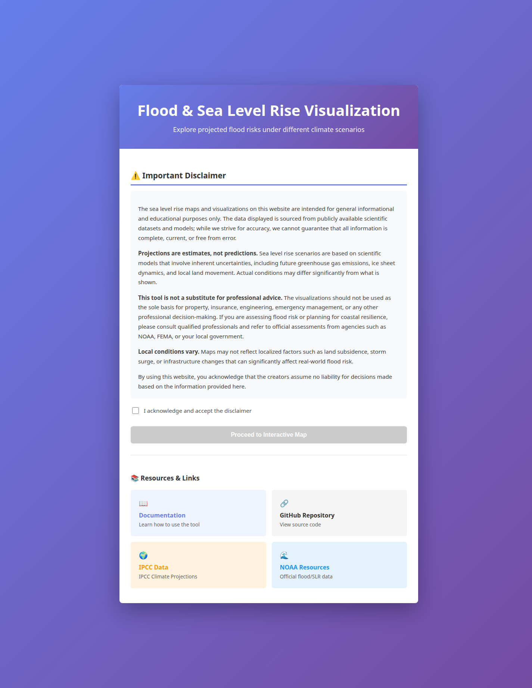
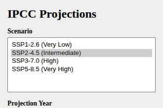
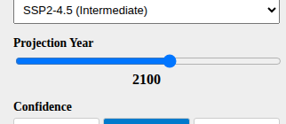
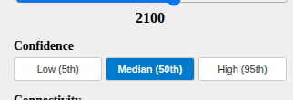
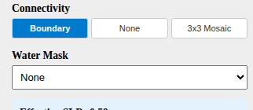
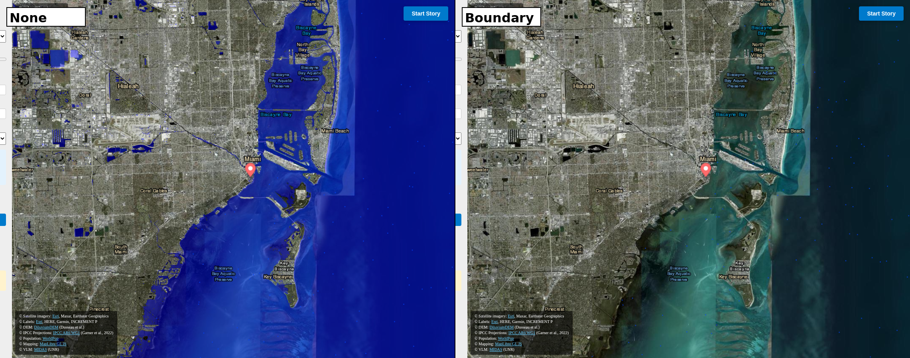
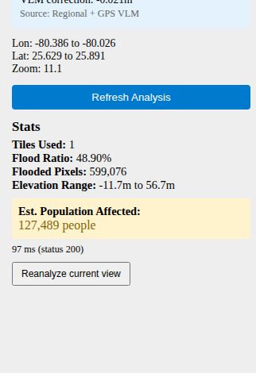
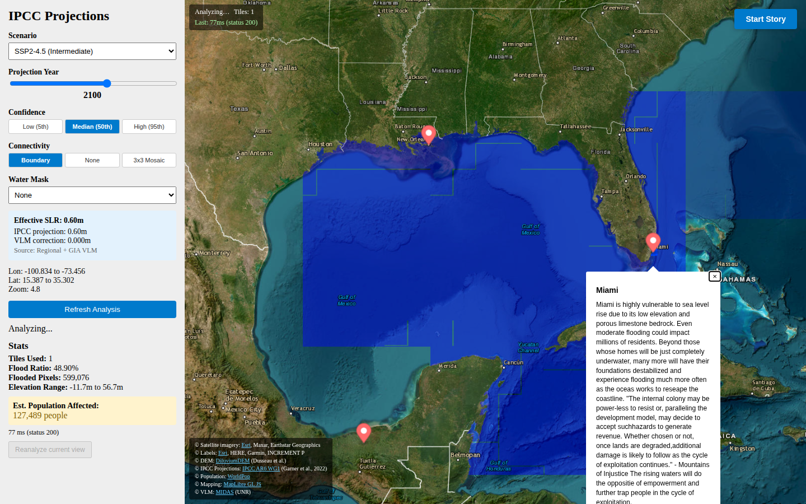

# User Guide

This page explains every control in the interactive map and what each one does.

---

## First time here? Read this once

The tool answers a single question: *if seas rise by amount X, which coastlines fall under
water and how many people live there?*

You change three things in the sidebar:

1. **Scenario** — how much greenhouse gas the world emits (low/medium/high/very high)
2. **Year** — how far in the future you are asking about (2030 to 2150)
3. **Percentile** — how cautious vs. pessimistic you want the estimate (5th / 50th / 95th)

The blue overlay on the map is the land that ends up under water at those settings, after
adjusting for whether the land itself is sinking or rising. The yellow box at the bottom of
the sidebar tells you roughly how many people live in that area today.

If you want a guided tour through five flood-vulnerable cities, click **Start Story** in the
top-right corner of the map. See [Story Mode](Story-Mode) for details.

For the scientific assumptions and what the model does and does not represent, see
[Data Sources](Data-Sources#what-this-model-does-and-does-not-represent).

---

## Interface Overview

The application has three top-level views:

1. **Landing Page** — disclaimer and links, shown once per session.
2. **Interactive Map** — the main exploration tool with a sidebar on the left.
3. **Story Mode** — full-screen guided city narratives (no sidebar).



---

## Landing Page



- Read the disclaimer. It explains that projections are scientific estimates, not certified
  engineering assessments.
- Tick **"I acknowledge and accept the disclaimer"**.
- Click **Proceed to Interactive Map**.

The disclaimer is shown once per session. Refreshing the page shows it again.

---

## Sidebar Controls

### Scenario



Choose the Shared Socioeconomic Pathway that drives the sea level projection:

| Option | Emissions trajectory |
|--------|---------------------|
| **SSP1-2.6 (Very Low)** | Strong mitigation; warming well below 2 °C |
| **SSP2-4.5 (Intermediate)** | Moderate action; current policy trajectory |
| **SSP3-7.0 (High)** | Fragmented action; growing emissions |
| **SSP5-8.5 (Very High)** | Fossil-fuel intensive development |

Changing the scenario immediately updates the SLR value and redraws the flood overlay tiles.

---

### Projection Year



Drag the slider from **2030** to **2150** in 10-year steps. Earlier years show less flooding
under most scenarios; later years compound the effect.

---

### Confidence (Percentile)



| Button | Meaning |
|--------|---------|
| **Low (5th)** | 5th percentile — conservative / optimistic projection |
| **Median (50th)** | Central estimate (default) |
| **High (95th)** | 95th percentile — upper-end / pessimistic projection |

The 95th percentile reflects scenarios where ice-sheet dynamics accelerate beyond current
median models.

---

### Effective SLR Box



This box appears once the backend resolves the sea level rise for the current map center. It shows:

- **Effective SLR** — the value used to render flood tiles (IPCC + VLM).
- **IPCC projection** — the raw regional or global-mean projection.
- **VLM correction** — vertical land motion offset in meters (positive = subsidence = more flooding).
- **Source** — whether regional data or global-mean fallback was used, and the VLM source
  (GPS MIDAS, GIA model, or none).

---

### Connectivity



Controls which below-threshold DEM pixels are colored as flooded:

| Mode | Behaviour |
|------|-----------|
| **Boundary** (default) | Only connected to the tile edge — removes isolated inland depressions |
| **None** | All below-threshold pixels, including disconnected basins |
| **3×3 Mosaic** | Expands the render to the 3×3 tile neighborhood so flooding can propagate across tile seams before cropping to the requested tile |

**When to use each:**

- **Boundary** is best for realistic coastal inundation (ocean reaches land via the coast).
- **None** is useful for seeing every low-lying area, regardless of ocean connectivity.
- **3×3 Mosaic** is helpful at tile boundaries where connectivity appears to be cut off.

---

### Water Mask

| Option | Description |
|--------|-------------|
| **None** (default) | No ocean/water pre-filtering |
| **Raster (if configured)** | Applies an ocean water mask from a configured raster source to constrain where flooding can start — requires a water mask file to be configured server-side |

---

### Region Stats



After the backend analyzes the current viewport, the sidebar shows:

| Stat | Meaning |
|------|---------|
| **Tiles Used** | Number of DEM 1°×1° tiles that intersect the viewport |
| **Flood Ratio** | Percentage of valid DEM pixels below the SLR threshold |
| **Flooded Pixels** | Raw count of flooded DEM pixels in the region |
| **Elevation Range** | Min and max elevation (meters) across the viewport |
| **Est. Population Affected** | Sum of WorldPop 2020 population in flooded pixels |

> **Note:** If the viewport spans more than 40° in latitude or longitude, regional analysis is
> skipped until you zoom in. A message will appear in the sidebar.

---

### Refresh Analysis

Click **Refresh Analysis** to re-query the backend immediately (useful after toggling
connectivity mode or water mask without panning the map).

**Reanalyze current view** does the same but cancels any in-flight request first.

---

## Map Canvas

### Basemap

The map uses the **Esri World Imagery** satellite tile layer with **Esri Boundaries & Places**
label overlay. Both are loaded from Esri's public ArcGIS REST tile services.

### Flood Overlay

Semi-transparent blue pixels mark areas the backend identifies as below the effective SLR
threshold. The overlay is a live raster tile layer — every tile request passes the current
scenario, year, percentile, connectivity mode, and water mask as query parameters.

Tiles are cached server-side (LRU in-memory + optional Redis) so repeated views of the same
area are fast.

### City Markers



Red pin markers are placed at the five story locations. Click any marker to open a popup
with a short description of the city's flood risk context.

### Status Bar (top-left corner of map)

Shows the current analysis state and last request timing:

```
Analyzing…    Tiles: 4
Last: 312ms (status 200)
```

Green text = successful response; red text = error.

---

## Start Story Button

Click **Start Story** (top-right) to enter [Story Mode](Story-Mode). The sidebar is hidden
and a story panel slides in from the left.

Click **Exit Story** to return to the interactive map with your previous sidebar settings.

---

## Attribution

The bottom-left of the map lists all data source attributions with links:
Esri, DiluviumDEM, IPCC AR6 WG1, WorldPop, MapLibre GL JS, and MIDAS.
